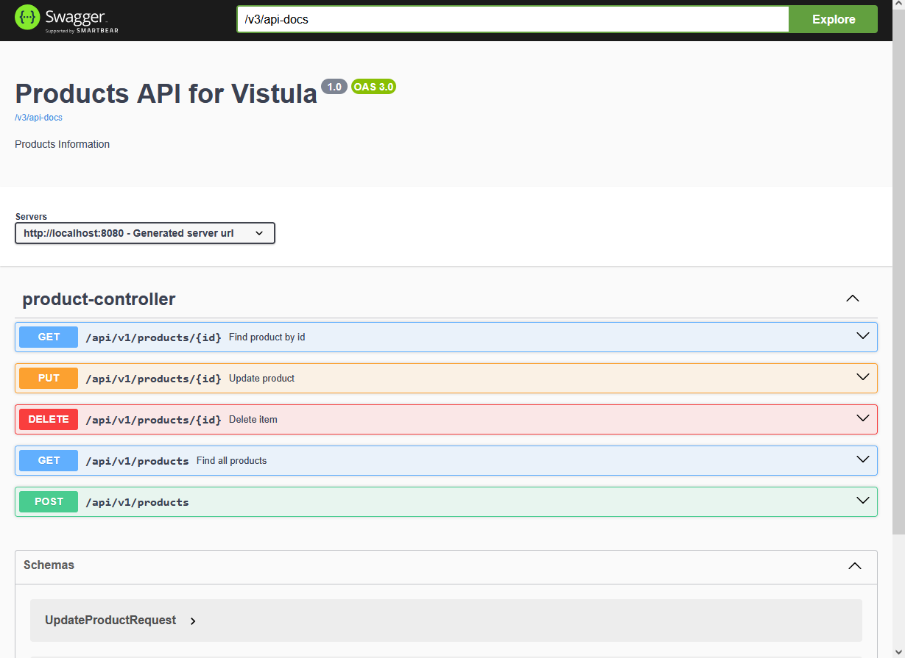

# Spring Boot REST API with H2 Database - Task 2

## Project Description
This is a fully functional REST API for managing a product catalog. It follows the professional layered architecture and implements full CRUD operations with persistent storage in an H2 in-memory database.

## Technologies Used
* Java 25 / Spring Boot 3.x
* Spring Data JPA / Hibernate
* H2 In-Memory Database
* Swagger UI (SpringDoc OpenAPI)
* Lombok

## Layered Architecture (Stereotypes)
The project is divided into specific packages for better maintainability:
* **API Layer**: `ProductController` handles HTTP requests.
* **Service Layer**: `ProductService` contains business logic.
* **Domain Layer**: `Product` entity representing the database table.
* **Repository Layer**: `ProductRepository` (JpaRepository) for database communication.
* **Support Layer**: `ProductMapper` for DTO conversion and `ExceptionAdvisor` for error handling.

## API Endpoints (CRUD)
| Method | Endpoint | Description |
|--------|----------|-------------|
| POST | `/api/v1/products` | Create a new product |
| GET | `/api/v1/products` | Get list of all products |
| GET | `/api/v1/products/{id}` | Find a specific product by ID |
| PUT | `/api/v1/products/{id}` | Update product details |
| DELETE| `/api/v1/products/{id}` | Remove a product from database |

## Special Features
* **Swagger UI**: Interactive API documentation available at `http://localhost:8080/swagger-ui/index.html`.
* **H2 Console**: Database management available at `http://localhost:8080/console` (JDBC URL: `jdbc:h2:mem:testdb`).
* **Exception Handling**: Custom `ProductNotFoundException` returns a clean 404 error instead of a system crash.

## Screenshots
> **Note to student:** Place your Swagger and H2 Console screenshots here.

